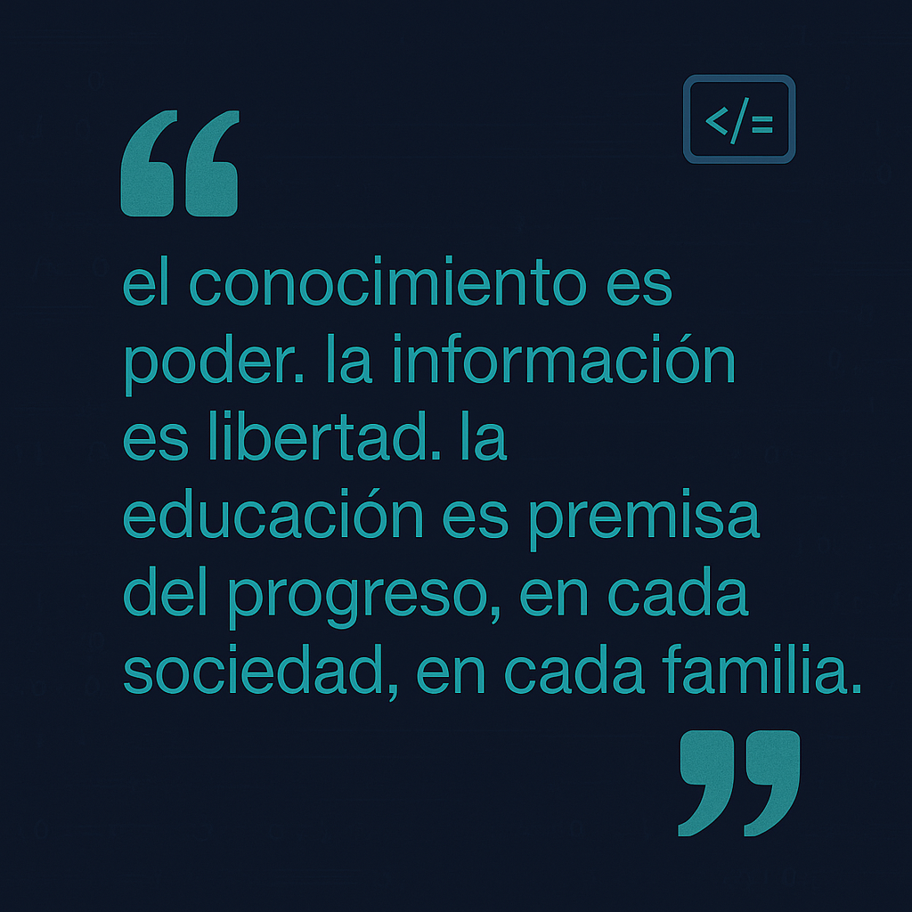

<h1 align="center">Hola , Soy Kevin</h1>

	
## <picture style="margin-left:100px"></picture> ACERCA DE MI

<picture> </picture>

  

- ESTUDIOS : Desarrollador Junior FullStack Actualmente Cursando el tercer ciclo de Ing de Software en el instituto Servicio Nacional de Adiestramiento en Trabajo Industrial.
- DATOS :Soy un PROGRAMADOR apasionado que siempre anda en busca de mas conocimiento , suelo desarrollar constantes practicas en paginas web , como codecrafters ,CodeWars, etc...
- OBJETIVO : Aprender, TODO  lo posible , TODO lo relacionado a las tecnologias que practico , soy de las personas que creen que todo lo que aprendes, por más insignificante que parezca , es útil.
 

## <picture>  </picture> Contactame

	
	
	
	

## 🛠️ HABILIDADES

### <picture>   </picture> LENGUAJES DE PROGRAMACION

  &emsp;
  
  &emsp;
  
  &emsp;
   

### <picture>   </picture> Frontend Dev

 
  &emsp; 
     
  &emsp;
   
  &emsp;
  
  &emsp;
  

 ### <picture>   </picture> Herramientas y +
 

  &emsp;
    
  &emsp;
    
  &emsp;
    
  &emsp;
    

 ### <picture>   </picture> IDEs
 

  &emsp;
    
    &emsp;
    
  &emsp;
    
  &emsp;
    

 ### <picture>   </picture> Sistemas Operativos 
 

>
  &emsp;
    
  &emsp;
    

  

---

	<a href="https://github.com/kevin103012"> 

  
	

